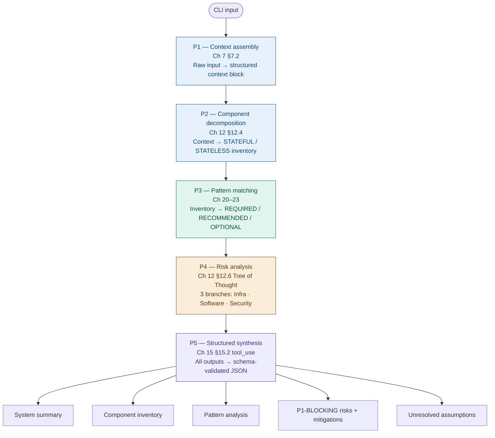

# arch-analyser

A CLI tool that analyses a software architecture description and returns a structured breakdown of components, patterns, and risks. Give it a one-line system description. It runs five prompts in sequence and produces a JSON report with every component classified, every pattern ranked REQUIRED / RECOMMENDED / OPTIONAL, and every risk scored and assigned a mitigation.

Every architecture starts somewhere. This tool gives you that starting point — a component inventory, a pattern checklist, and a risk register — before the first whiteboard session. It won't replace an architect, but it will make sure the conversation starts with the right questions already on the table.

Built as a portfolio project demonstrating the Plan-and-Execute prompting pattern from *Prompt Engineering* (Sadot, 2025).

---

## How it works

Five API calls, each consuming the output of the previous one. No single prompt does everything — the pipeline compounds context across stages so the final risk analysis knows exactly which components exist and which patterns are missing.



Responses are cached locally by input hash. Re-running the same input costs nothing — only new inputs hit the API.

---

## Installation

Requires Python 3.11+ and [uv](https://docs.astral.sh/uv/).

```bash
# Install uv (if needed)
curl -LsSf https://astral.sh/uv/install.sh | sh

# Clone and set up
git clone https://github.com/yourname/arch-analyser
cd arch-analyser
uv sync
```

`uv sync` reads `pyproject.toml`, creates `.venv/` automatically, and installs all dependencies in one shot. No manual `pip install` or `python -m venv` steps.

To run commands without activating the virtual environment:

```bash
uv run arch-analyser "..."
uv run pytest tests/
```

Or activate it when you need an interactive shell:

```bash
source .venv/bin/activate        # macOS / Linux
.venv\Scripts\activate           # Windows
```

Set your API key:

```bash
cp .env.example .env
# Edit .env and add your ANTHROPIC_API_KEY
```

---

## Usage

```bash
# Basic analysis — renders rich console output
uv run arch-analyser "departure control system, 500 concurrent check-ins, PostgreSQL, Redis, Kafka, SITA integration"

# Save JSON report + markdown report
uv run arch-analyser "baggage reconciliation system, 10k bags/hour, Kafka, Oracle, IATA Type B" --output reports/brs.json

# JSON to stdout (for piping)
uv run arch-analyser "weight and balance system, A320 fleet, PostgreSQL" --json

# Force re-run, ignore cache
uv run arch-analyser "payment gateway, 1M TPS, PostgreSQL, Kafka, PCI-DSS" --no-cache

# Use a different model
uv run arch-analyser "crew FDP tracking system, PostgreSQL, Redis" --model claude-opus-4-5
```

### Output

Passing `--output reports/dcs.json` saves two files:

```
reports/
├── dcs.json    — raw structured data, machine-readable
└── dcs.md      — formatted report, human-readable, portfolio-ready
```

The markdown report contains the system summary, component table, patterns grouped by REQUIRED / RECOMMENDED / OPTIONAL, risks grouped by severity with mitigations, and the unresolved assumptions list.

Console output:

```
System summary
Components : 20   (SPECIFIED vs INFERRED · STATEFUL / STATELESS / HYBRID)
Patterns   : 24   (REQUIRED / RECOMMENDED / OPTIONAL)
Risks      : 20 total · 8 P1-BLOCKING · 8 P2-HIGH · 0 CROSS-BRANCH

P1-BLOCKING risks table (name · branch · mitigation)

Unresolved assumptions (re-run with these specified to sharpen the analysis)
```

---

## Project structure

```
arch-analyser/
├── arch_analyser/
│   ├── cache.py            # File-based response cache (SHA-256 keyed)
│   ├── cli.py              # argparse entry point + markdown report renderer
│   ├── pipeline.py         # Orchestrator — calls P1-P5 in sequence
│   ├── schema.py           # architecture_breakdown tool schema (Ch 15 §15.2)
│   └── prompts/
│       ├── p1_context.py   # Context assembly
│       ├── p2_decompose.py # Component decomposition
│       ├── p3_patterns.py  # Pattern matching
│       ├── p4_risks.py     # Risk analysis (Tree of Thought)
│       └── p5_synthesis.py # Structured synthesis via tool_use
├── reports/                # JSON + markdown output files (gitignored)
├── .cache/                 # Response cache (gitignored)
├── CLAUDE.md               # Project guidelines for Claude Code
└── pyproject.toml
```

---

## Domain examples

These inputs demonstrate the tool on airline PSS systems. All vocabulary is publicly documented — IATA, SITA, and standard DCS/BRS terminology.

```bash
# Departure control
uv run arch-analyser "departure control system, 500 concurrent check-ins, PostgreSQL, Redis, Kafka, SITA integration" --output reports/dcs.json

# Baggage reconciliation
uv run arch-analyser "baggage reconciliation system, 10k bags/hour, event-sourced, Kafka, Oracle, IATA Type B messaging, BSM/BPM messages" --output reports/brs.json

# Weight and balance
uv run arch-analyser "weight and balance system, A320/B737 fleet, 200 flights/day, PostgreSQL, real-time load sheet generation" --output reports/wab.json

# Crew FDP tracking
uv run arch-analyser "crew flight duty period tracker, 5000 crew members, PostgreSQL, Redis, regulatory compliance, REST API" --output reports/fdp.json
```

---

## Prompt engineering notes

Each prompt maps to a specific chapter in the book (you can request me a copy  at sadot [dot] arefin [at] gmail [dot] com):

| Prompt | Pattern | Book reference |
|--------|---------|----------------|
| P1 — Context assembly | Level 2 context construction | Ch 7 §7.2 |
| P2 — Component decomposition | Least-to-most decomposition | Ch 12 §12.4 |
| P3 — Pattern matching | Constraint-driven selection | Ch 13 §13.2, Ch 20-23 |
| P4 — Risk analysis | Tree of Thought, 3-branch | Ch 12 §12.6-12.7 |
| P5 — Structured synthesis | tool_use, nullable fields | Ch 15 §15.2-15.3 |
| Pipeline | Plan-and-Execute | Ch 16 §16.3 |

The key design decision: P4 reasons through infrastructure, software, and security branches independently before synthesising. Risks flagged `CROSS-BRANCH` appear across multiple branches without prompting — those are the highest-confidence findings.

---

## Windows note

File output uses UTF-8 encoding explicitly. If you see a `UnicodeEncodeError` from an older version of the tool, update to the latest `cli.py` — both `write_text` calls now pass `encoding="utf-8"`.

---

## Future enhancements

- **HTML report export** — render the JSON output as a self-contained HTML file with sortable risk table and component graph
- **Anthropic prompt caching** — use the API's cache-control headers on large P3/P4 context blocks to cut token cost ~90% on repeated runs
- **Confidence scoring** — add a sixth prompt that scores each finding against the `[UNSPECIFIED]` list and flags which risks are assumption-dependent
- **Diff mode** — compare two JSON reports and surface what changed between architecture versions
- **Custom domain profiles** — allow a `--profile airline` flag that injects domain-specific constraints (IATA standards, aviation compliance, SITA integration patterns) into the P1 context block
- **GitHub Actions integration** — run the pipeline on architecture ADRs committed to a repo and post the risk summary as a PR comment
- **MCP server** — expose the pipeline as an MCP tool so it can be called from Claude Code or any MCP-compatible client

---

## Requirements

- Python 3.11+
- [uv](https://docs.astral.sh/uv/) 0.4+
- Anthropic API key with credit balance
- Dependencies: `anthropic`, `python-dotenv`, `rich`

---

## License

MIT